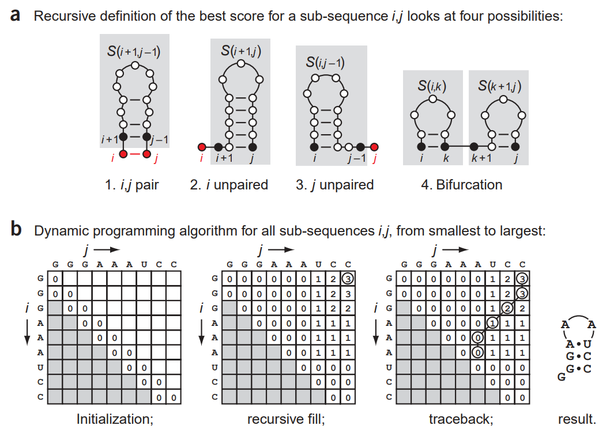

<script type="text/x-mathjax-config">
MathJax.Hub.Register.StartupHook('TeX Jax Ready', function () {
  MathJax.InputJax.TeX.prefilterHooks.Add(function (data) {
    data.math = data.math.replace(/^% <!\[CDATA\[/, '').replace(/%\]\]>$/, '');
  });
});
</script>

# Nussinov algorithm for nucleic acid secondary structure prediction
## Algorithm description
Worst-case performance: $O(n^3)$ \
**Formulation**: \
Let $S$ be a sequence of $n$ elements taken from the set $\{A, U, G, C\}$ with replacement. We need to find such spatial conformation of a single-strand nucleic acid that maximizes the number of bonds between bases. For the simplest case our scoring sysrem is going to be +1 for bond and 0 otherwise. \
**Solution**: \
The optimal score of the subsequence $S_{i:j}$, where $0 \leq i < j \leq n - 1$ assuming our array is 0-indexed, can be expressed as the sum of the optimal scores of its constituent subsequences.
1) Construct $n \times n$ matrix $M$, where our diagonal and upper sub diagonal is filled with 0s:
$M(i, i) = 0$, $M(i, i-1) = 0$.
2) Start filling out our matrix from the bottom to the upper right corner, where $M(0, n-1)$ is the optimal score for the complete sequence with the length $n$.
3) The filling rule is
$$
M(i, j) = \max \left\{
\begin{array}{ll}
M(i + 1, j-1) + 1 & \text{if paired} \\
M(i + 1, j) \\
M(i, j-1) \\ 
\max_{i<k<j}S(i,k) + S(k+1, j)
\end{array}
\right.
$$

4) Traceback the optimal path that got us into the upper corner.


[Eddy SR. How do RNA folding algorithms work? Nat Biotechnol. 2004 Nov;22(11):1457-8](https://www.molgen.mpg.de/3710236/eddy2004.pdf)

**Useful resources:** \
[Forna visualization website](http://rna.tbi.univie.ac.at/forna/) \
[Freiburg Bioinformatics Group](https://rna.informatik.uni-freiburg.de/Teaching/index.jsp?toolName=Nussinov)
## Installation
```
python -m pip install git+https://github.com/MelnychenkoM/my_rna_fold.git
```
## Usage
```
import rna_fold
rna_fold.version()

seq = "AGACGACAAGGUUGAAUCGCACCCACAGUCUAUGAGUCGGUG"
rna_fold.fold(seq)
```

